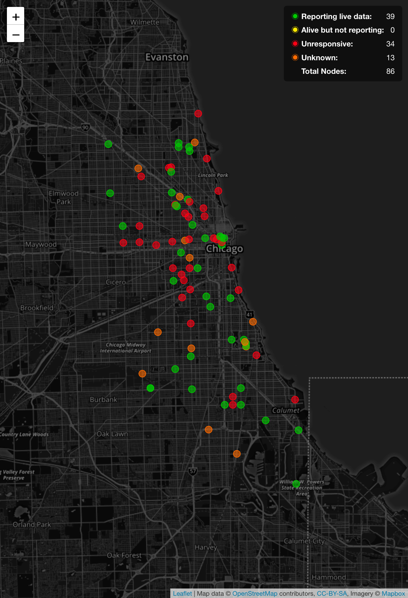
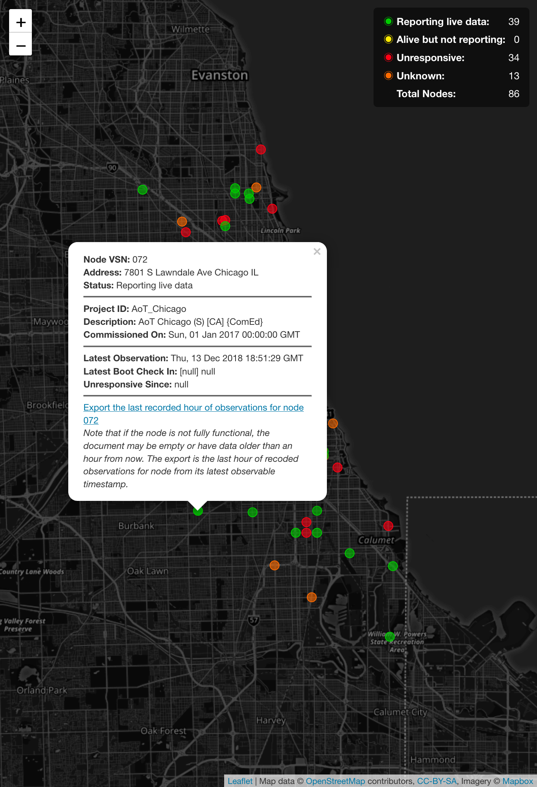

# Array of Things Chicago Node Status

This is an application suite that pulls data from several sources
and combines it into a simple reporting system. The aggregated
data is then made available for consumption via CSV, JSON, or
GeoJSON export. There is also an interactive Map UI.

 

## Local Development

This is a pretty straight forward process:

```bash
$ docker-compose build
$ docker-compose up
```

This will bring up the following containers:

- `rabbitmq` as the task queue store
- `postgres` to store the pulled/scraped data
- `tasks` that run on a schedule to pull and scrape data and prune the database
- `web` to expose the resource endpoints and serve the map ui
